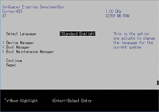

## The Developerbox UEFI setup guide

---------------------------------
This manual is written for your Developerbox to configure UEFI's boot options.

### Use cases

---------------------------------

- [Add Boot Option](./addbootoption.md)
- [Delete Boot Option](./delbootoption.md)
- [Change Boot Order](./changebootorder.md)
- [Set eMMC enable](./enableemmc.md)
- [Set ACPI enable](./enableacpi.md)

### UEFI menu list

---------------------------------

- Device Manager
  - Driver Health Manager
  - SynQuacer Platform Settings
  - Console Preferene Selection
  - 96boards Mezzanine options
  - iSCSI Configuration
  - Network Device List

- Boot Manager(Initial)
  - Install Debian Stretch (Linaro ERP) over HTTP
  - UEFI HDT722525DLA380
  - UEFI HTTP4
  - UEFI HTTP6
  - UEFI PXEv4
  - UEFI PXEv6
  - UEFI Shell

- Boot Maintenance Manager
  - Boot Options
  - Driver Options
  - Console Options
  - Boot From File
  - Boot Next Value
  - Auto Boot Time-out

