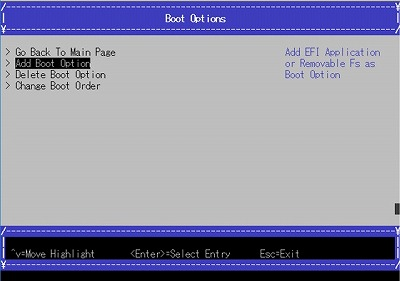
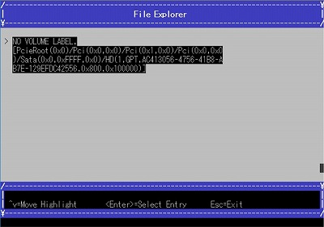
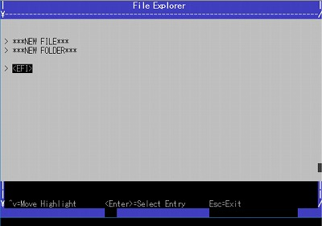
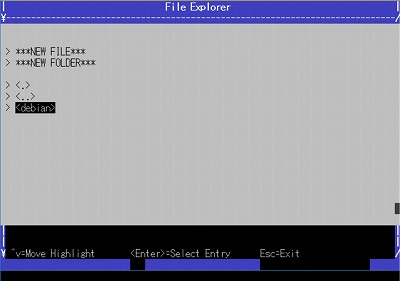
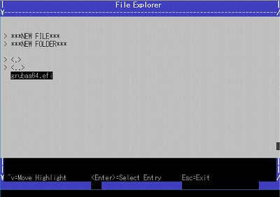
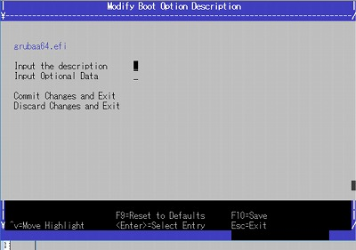
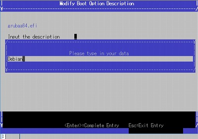
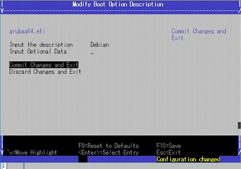
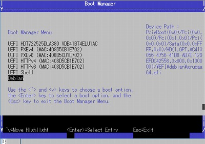

### Add Boot Option

[Back](./index.md)

Here shows the way to add new grub boot option.

Select "Boot Maintenance Manager" from the top menu.

Select "Boot Options" from the Boot Maintenance Manager menu.

Select "Add Boot Option" from the Boot Options menu.

Select the text area at the File Explorer.

Find grubaa64.efi at ./EFI/debian.
Select EFI.

Select debian.

Select grubaa64.efi.

Select "Input the description".

Type any character as a label(eg.Debian)

Select "Commit Changes and Exit".

You can find new boot option at Boot Manager.

