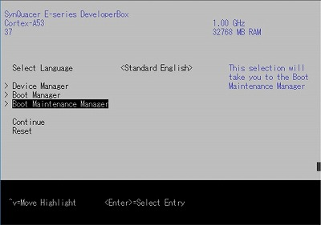
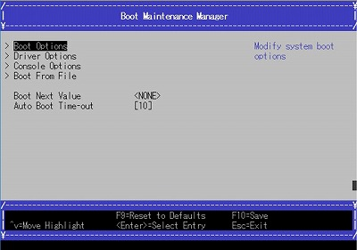
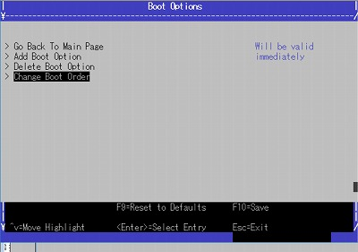
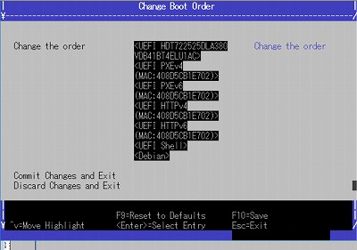
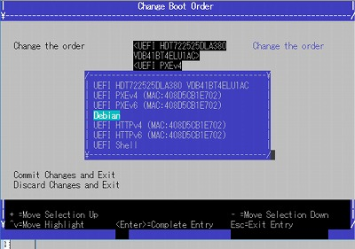
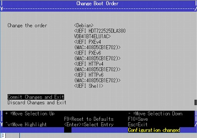

### Change Boot Order

Select "Boot Maintenance Manager" from the top menu.

Select "Boot Options" from the Boot Maintenance Manager menu.

Select "Change Boot Order" from the Boot Options menu.

Select the boot image list.

Change order of any boot image you desire;

press "+" to up or press "-" to down: then press ENTER.

Make sure if the order changed and select "Commit Changes and Exit".

