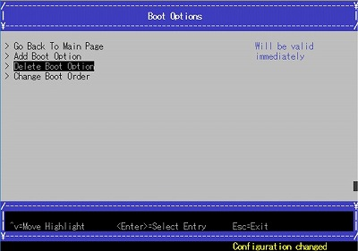
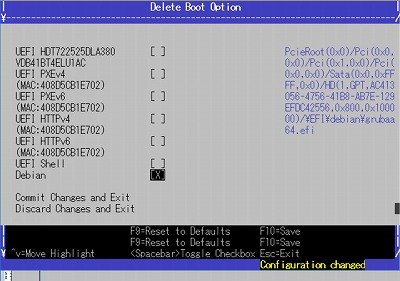
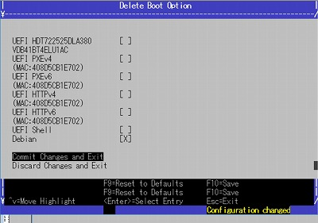
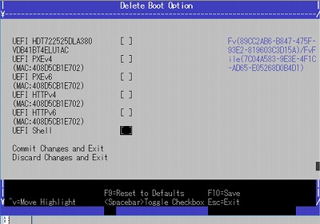

### Delete Boot Option

[Back](./index.md)

Select "Boot Maintenance Manager" from the top menu.

Select "Boot Options" from the Boot Maintenance Manager menu.

Select "Delete Boot Option" from the Boot Options menu.

Try to delete Debian boot option.

Select any option, check [X] with spacebar, then press F10.

Select "Commit Changes and Exit".

You can find boot the option deleted at Delete Boot Option.

