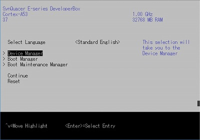
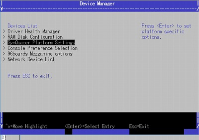
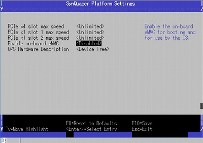
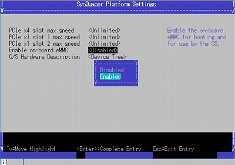
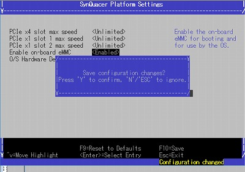
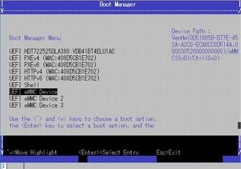

### Set eMMC enable

[Back](./index.md)

Select "Device Manager" from the top menu.

Select "SynQuacer Platform Setting" from the Device Manager menu.

Select "Enable on-board eMMC" from the SynQuacer Platform Setting menu.

Select Enabled.

Save to press F10 and type "Y".

Then, reboot, enter UEFI, select "Boot Manager".

eMMC appears.

